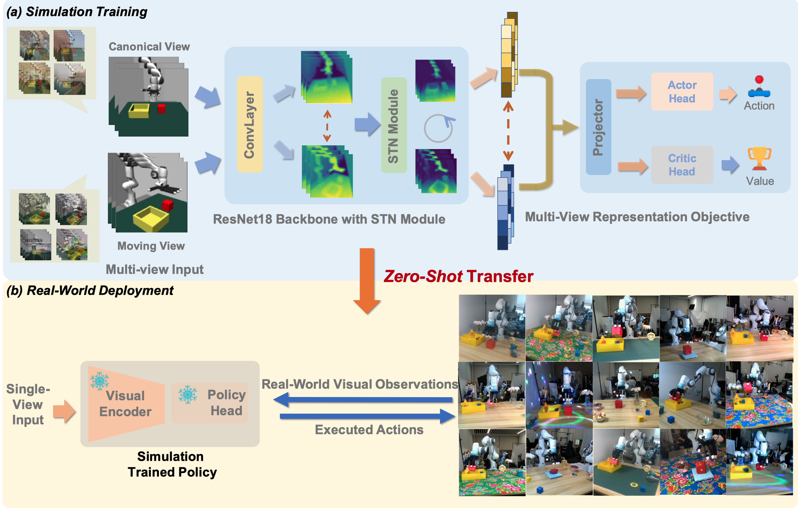

# Maniwhere

<a href="https://gemcollector.github.io/maniwhere/"><strong>Project Page</strong></a>
  |
  <a href="https://arxiv.org/abs/2407.15815"><strong>arXiv</strong></a>
  |

  <a href="https://gemcollector.github.io/">Zhecheng Yuan*</a>, 
  <a href="https://www.stillwtm.site/">Tianming Wei*</a>, 
  <a href="">Shuiqi Cheng</a>, 
  <a href="https://www.gu-zhang.com/">Gu Zhang</a>, 
  <a href="https://cypypccpy.github.io/">Yuanpei Chen</a>, 
  <a href="http://hxu.rocks/">Huazhe Xu</a>

  *The first two authors contribute equally. 

<div align="center">
  
</div>


# 💻 Installation

This repository ports `maniwhere` to modern PyTorch for compatibility with newer GPUs (RTX 40/50 series). 

```bash
# 1. Create and activate a conda environment
conda create -n maniwhere python=3.10 -y
conda activate maniwhere

# 2. Install PyTorch
pip install torch torchvision torchaudio --index-url https://download.pytorch.org/whl/cu128

# 3. Install required dependencies (Note: numpy < 2.0 is required for dm_control)
pip install "numpy<2.0.0" scipy pandas matplotlib scikit-learn
pip install "dm-control" "dm-env" "mujoco"
pip install hydra-core hydra-submitit-launcher omegaconf
pip install wandb tensorboard termcolor tqdm
pip install opencv-python imageio imageio-ffmpeg pillow
pip install kornia transforms3d
```

*Note: Headless MuJoCo rendering requires EGL/OpenGL system headers. On Ubuntu, install them via:*  
`sudo apt-get install libegl1-mesa-dev libgl1-mesa-dev libglew-dev`

  # 🛠️ Usage
The algorithms will use the [Places](http://places2.csail.mit.edu/download.html) dataset for data augmentation, which can be downloaded by running
```
wget http://data.csail.mit.edu/places/places365/places365standard_easyformat.tar
```
After downloading and extracting the data, add your dataset directory to the datasets list in `cfgs/aug_config.cfg`.

For training:

```
bash scripts/train.sh
```

For evaluation:
```
bash scripts/eval.sh ours
```
You should modify the  `model_path` in `mani_eval.py` first. You would better to check the saved video. The recorded success rate might miss some successful trials. Meanwhile, you need to uncomment the `get_termination` function in the Python file for the tasks: `['xarm_close_dex', 'franka_dual_dex', 'franka_bowl_dex']` under `envs/tasks/` to serve as evaluation metrics. However, it should remain commented out during training.


# 📝 Citation

If you find our work useful, please consider citing:
```
@article{yuan2024learning,
  title={Learning to Manipulate Anywhere: A Visual Generalizable Framework For Reinforcement Learning},
  author={Yuan, Zhecheng and Wei, Tianming and Cheng, Shuiqi and Zhang, Gu and Chen, Yuanpei and Xu, Huazhe},
  journal={arXiv preprint arXiv:2407.15815},
  year={2024}
}
```
# 🙏 Acknowledgement
Our code is generally built upon [DrQ-v2](https://github.com/facebookresearch/drqv2). The robot model built upon [mujoco-menagerie](https://github.com/google-deepmind/mujoco_menagerie) . The website is borrowed from  [DP3](). We thank all these authors for their nicely open sourced code and their great contributions to the community.

# 🏷️ License
This repository is released under the MIT license. 